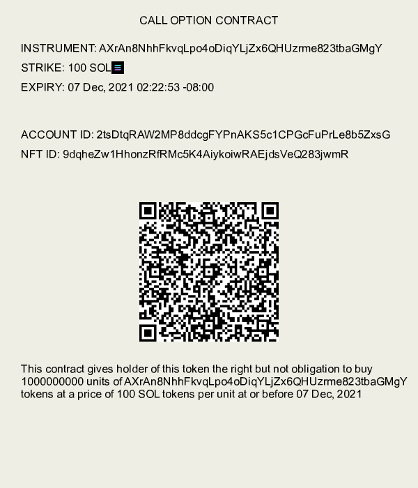
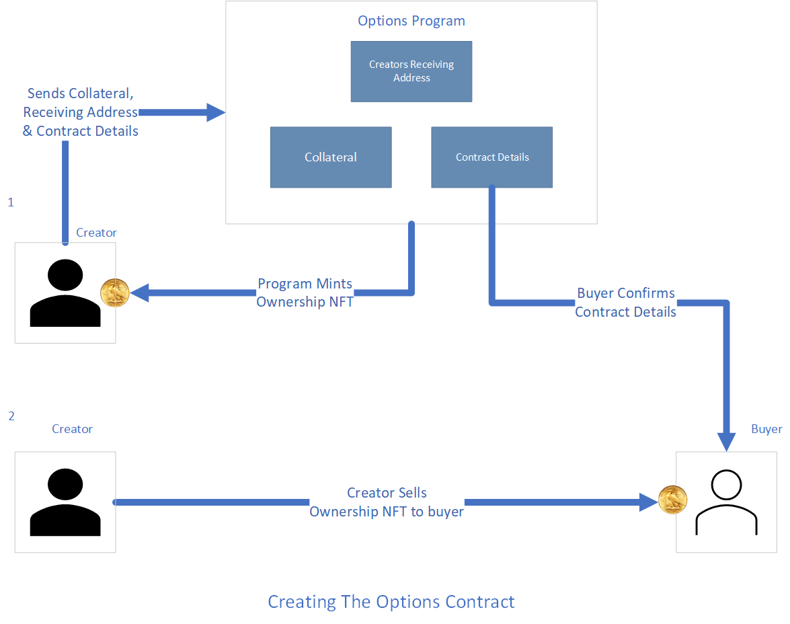
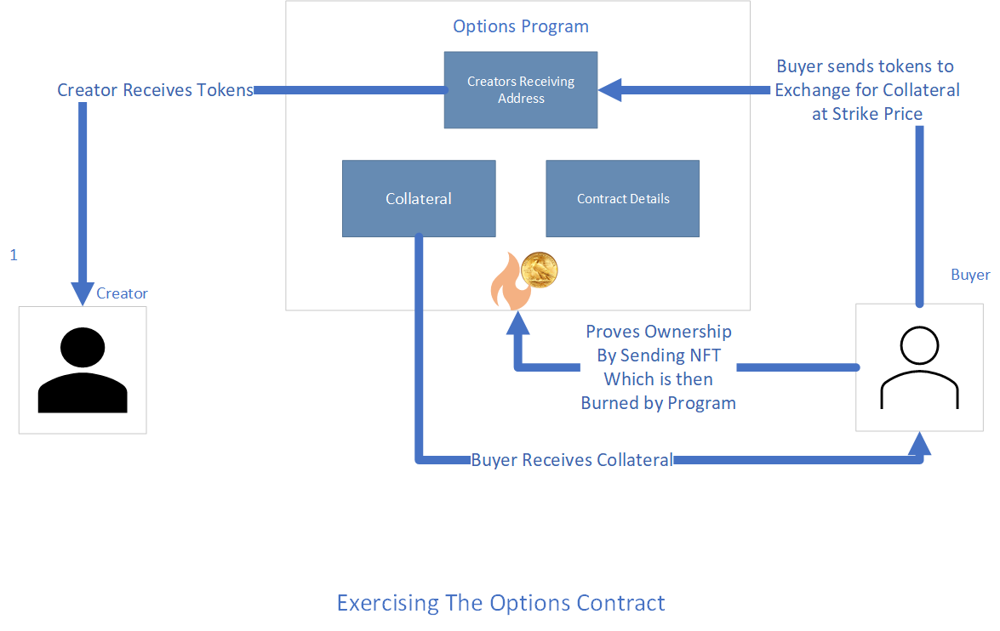
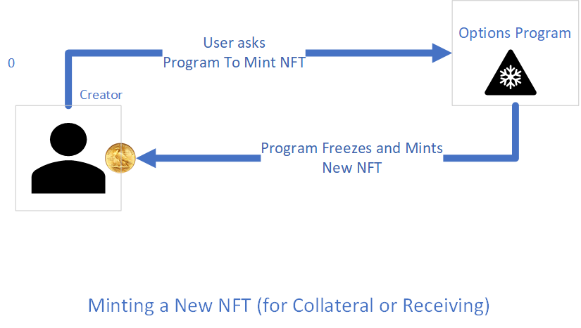

# Solana NFT Options (BETA)
This is a tool for creating and exercising options contracts for tokens and NFTs on the Solana blockchain. This program is currently running on devnet.
See https://nftoptions.app

### Table of Contents  
[Installation](#installation)  
[Examples](#examples)  
[Publishing Contracts](#publish)  
[Motivation](#motivation)   
[Benfits of Options on the Blockchain](#benfits-of-options-on-the-blockchain)   
[Design](#design)  

## Installation

    npm install solana-options


## Examples

Let's show how you can create a call contract to sell 420 units of SOL token for 69 USDC token each expiring 10 minutes from now

```Javascript
var sol = require("@solana/web3.js");
var sol_options = require("solana-options")

// included for example purpose.
// In practice this would come securely from a wallet such as Phantom e.t.c
const your_private_key = [45,142,52,139,158,173,187,83,102,42,19,164,139,139,205,
 206,230,214,180,206,143,85,173,181,255,225,10,156,247,8,71,177,181,140,215,
 137,129,185,26,79,119,184,240,246,7,123,174,112,154,172,151,52,204,95,75,118,
 145,69,121,55,243,232,216,63]

// connect to your cluster e.g localhost or devnet
const connection = new sol.Connection("https://api.devnet.solana.com", 'singleGossip');

```

```Javascript
// create a call contract contract

// your account.  In practice this would come securely from a wallet like Phantom e.t.c
let creator_acc = sol.Keypair.fromSecretKey(new Uint8Array(your_private_key))

// set strikes and expiry
let strike = 69
let expiry = Date.now()/1000 + 600 //expire in 10 mins (600s)
let multiple = 420

// the address or symbol you are selling on this call
let instrument = "SOL"
// alternatively you can use the address of the token
// e.g let instrument = new PublicKey("SOL1111111111111111111111111111111")

// the token address or symbol of the token you recieve if the call is exercised
let strike_instrument = "USDC"


// the address of your accounts that you will send and receive these instruments. 
// for this example your instrument account must hold 420 SOL that will be used as collateral
let creator_instrument_acc = new sol.PublicKey("45AFNwW71KwdSPXGgEJVhKGMHjEDnH4ECVSd59SFJ7R3")
let creator_strike_instrument_acc = new sol.PublicKey('9H39mHQDLNN1crrQFwRu5w8Euje5k3pfzKxkHaD51gXw')

// create the call
create_call(
    connection,strike, expiry, multiple, creator_acc, instrument, strike_instrument, 
    creator_instrument_acc, creator_strike_instrument_acc
).then(([sig, contract])=>{
    console.log(sol_options.print_contract(contract))
})
```

```json
{
    "strike": 69,
    "expiry": 1640148885.292,
    "multiple": 420,
    "instrument": "SOL1111111111111111111111111111111",
    "strike_instrument": "EPjFWdd5AufqSSqeM2qN1xzybapC8G4wEGGkZwyTDt1v",
    "nft_id": "9dpDMmB9pZk1zvRg8eTkvTrY7krwhG59WJ6UNgUKBYgz",
    "nft_account": "FyMJLrW3jBr4EqSaGuFfX3SWAEM5ZcEjD4xiwF7LqJY8",
    "account_id": "Db7AumhkBYaNkh4QZMPFiGGW8gGFJ4WvTDm8DRPVWFJy",
    "collateral_acc": "5cNgbTSQAdmyJRJLr9bqFTLMSQV1FRKTJoJXMViVr1uR",
    "writer_recv_acc": "9H39mHQDLNN1crrQFwRu5w8Euje5k3pfzKxkHaD51gXw",
    "writer": "DDhMZx3tJLat2Vhx7NEKxRWFT7hg82h8yMeJbSPL3fe6",
    "kind": "call"
}
```

## Publish

You can create an image for your contract too and publish it to https://nftoptions.app

```Javascript
    create_call(
        connection,strike, expiry, multiple, creator_acc, instrument, strike_instrument, 
        creator_instrument_acc, creator_strike_instrument_acc
    ).then(([sig, contract])=>{
        console.log(printed_contract(contract))
        sol_options.create_doc_img(contract).then(async img=>{
            img.write("example.png");
            await sol_options.publish_doc(contract)
        })
    })
```

`example.png`



## Motivation

### What are options?
The style of options in this package are almost identical to American Options traded on the stock market. Options are useful tools for limiting risk and can allow those will little capital more access to transactions that otherwise would have been difficult.

Let look at an example. Suppose Alice has a house she bought for $420,000. Say she is interested in moving and would be happy to sell it at $690,000 in the next 3 months. Bob is looking to buy houses in area. He does some research and is confident that the housing prices will rise in the next 3 months. He sees Alice's house and based on his research, it will have a value of $1.5 million in the next 3 months. For Bob, getting the house at $690,000 is a good deal but he doesn't have the $690,000 lying around to make the purchase. Alice can write an options contract that gives Bob the right to buy the house at $690,000 over the next 3 months and sells it to him for a premium (let’s say $25,000). That way, if Bob still doesn't find the money in 3 months Alice can pocket the $25,000. Bob buys the contract for $25,000 and buys himself some time to find the $690,000. Two months later, it turns out Bob was right and the price skyrockets to $1.5 million. Bob's contract is now worth $810,000 because he can buy the house for $690,000 and sell it $1.5 million. For a small $25,000 investment Bob has made a lot of profit. If Bob still likes he can look for the $690,000 to purchase the home (exercise the contract) or he can sell the contract to someone else who has the money to buy the home. So essentially, options allow you to trade the rights to ownership of an asset at a defined price over a period.

You can learn more about options [here]( https://www.investopedia.com/options-basics-tutorial-4583012) 

### Options on the Blockchain
In our example, we looked at real estate options. The same thing can be done with tokens on the blockchain. The cool thing about the blockchain, fungible and non-fungible tokens, is that you can "thingify" any asset and represent it as a token. In our example above, Alice could digitally make her contract by minting an NFT for her house and placing the contract on the blockchain. This package allows you to do that very easily. It also allows you to write options on any existing assets that are tokens in Solana such as SOL, USDC e.t.c

## Benfits of Options on the Blockchain
For those familiar with options on the stock market, options on Solana blockchain are a superset of stock market options with several key advantages
1. Transfers are direct. There are no brokers in between who make profit through arbitrage. The blockchain makes this trivial and protects holders from situations such as the [Gamestop Halting Fiaso](https://en.wikipedia.org/wiki/GameStop_short_squeeze#Halting_of_stock_purchases) e.t.c
2. You can only transfer assets you actually own. There are no naked options (options on assets not owned) that are prevalent on the stock market and add a lot of risk to the system.
3. Transparency. It very easy to verify ownership of tokens, NFTs and cryto assets.
4. More classes of assets. NFTs and tokens allow you to represent a broad range of assets in the digital universe. It's trivial to write contracts on one-of-a-kind assets through NFTs.


## Design
The options program is a rust program that lives on the Solana Blockchain. It acts as an authority and escrow for options. It verifies that the creator of the option has the assets they claim and transfers them to escrow. For each contract created, an NFT is minted by the program to mark ownership of the contract. This NFT is gifted to the contract creator. To sell the contract, the creator sells this NFT to the contract buyer. When a buyer attempts to exercise a contract, the program verifies that the buyer owns the NFT. 

There are two main classes of options: 
* Options on existing tokens/cryptocurrencies
* Options on new NFT (one-of-a-kind) assets


### Options on existing tokens/cryptocurrencies   

For existing tokens, the creator first ensures that they have accounts associated with the tokens. They then send the addresses of the tokens and accounts to the options program along with details specifying the contract type (call or put), strike, multiple and the instruction code for creating an option. Additionally, the NodeJS client creates an empty account that it sends along with the creator’s details. It also creates an options program account that will be used to hold the contract details. Additionally, it creates an address for an NFT that will be minted by the program to signify contract ownership.

Note that to have accounts live on the blockchain, some rent it paid. You can learn about Solana rent [here]( https://docs.solana.com/implemented-proposals/rent). In our design, generally the creator pays the rent for accounts that are created.  

Once the options program receives the accounts and details from the client it reads the instruction code and begins the create contract instruction. In Solana, code in the program is atomic. That means it will either completely pass or completely fail.  In other words, if an error occurs in the program, it would be as if it didn’t run at all. 

In the create instruction, the first step of the program is to transfer the collateral from the creator’s account to the collateral account. For example, if this is for a call to sell 100 (the multiple) units of SOL for 1000 (the strike) units of USDC each, the program would transfer 100 SOL to from the creator’s account to the collateral account. It will then take ownership of the collateral account.

Next, the options program mints an NFT that it uses to signify ownership of the contract. For clarity, we will call this the Ownership-NFT. The NFT is minted and frozen by the program to the address that creator owns. Only owners of this token can exercise the contract. To sell this contract, the creator issues this NFT to the buyer. By checking the details of the options account, the buyer can confirm that the ownership token matches the contract.

Next the options program saves the contract details (the state) into the options program account. Importantly, this state keeps the details of the address of the account where the creator will receive his strike instrument token (in the case of a call) or instrument token (in the case of a put) at exercise. In our example above, this will be the address where he will receive 1000 * 100 USDC for his 100 SOL in collateral.



To Exercise the contract, the buyer of the contract proves ownership by presenting the ownership NFT that he bought from the seller. Along with the details about the contracts and the accounts he will be using to exchange tokens for the collateral. In our example above, the buyer will submit an account where he will send the USDC from, and another account where he will receive the 100 SOL previously held as collateral.

The options program first verifies ownership via burning the NFT token. It then checks the details of the contract and finally makes the transfer if the contract hasn't expired. Because there is no easy and trusted way to get asset prices off the chain, buyers must take caution to ensure that the contracts they exercise are indeed “in-the-money”; the program will not enforce this. Once exercised, the program deletes its account and returns any rent or fees used back to the creator of the contract.

For contracts that have expired, the creator of the contract makes an explicit "close" instruction to program to return collateral, any rent, and delete the program account. This instruction will only execute if it is issued by the creator and if the contract is expired. The program uses the unix timestamp to determine whether the contract is expired or not.


### Options on new NFTs (one-of-a-kind assets)  

In the example above, we looked at an options contract for exchanging USDC and SOL. However, in many cases a person may want to trade an item that has no existing token, or one item that is hard appraise in an existing token. For example, one may want to write an options contract on their house or piece of art. The blockchain makes this very easy to do by minting NFTs (non-fungible-tokens) for such items. 

The options program has an optional "step 0" create-NFT-mint instruction where the creator can ask the program to mint an NFT for the instrument they want to write an option. For example, if Alice wants to create a call contract that gives Bob the write to buy her house for $69,420, she can call this create NFT instruction to mint an NFT for her house, the program will then store this NFT and only release it to Bob once he pays the $69,420 USDC



## Conclusion

Thank you so much for using this package. If you would like to contribute, or have suggestions, or questions, feel free to drop a PR or GitHub issue. Visit https://nftoptions.app to see some of the existing contracts. Join the discord for more updates https://discord.gg/AHtHnZY8.

## Resources & Credits
* Paul Schaaf has a great tutorial for writing contracts on Solana https://paulx.dev/blog/2021/01/14/programming-on-solana-an-introduction/
* MIT's book on Rust http://web.mit.edu/rust-lang_v1.25/arch/amd64_ubuntu1404/share/doc/rust/html/book/index.html
* The Solana Docs https://docs.solana.com/
* Solana Program Library https://github.com/solana-labs/solana-program-library/
